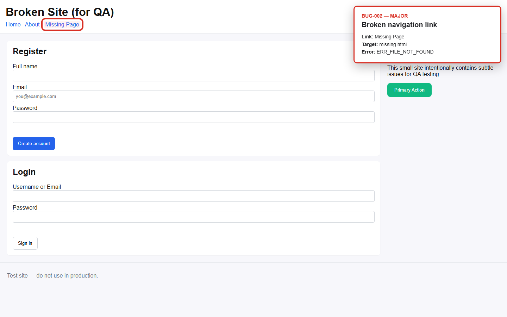
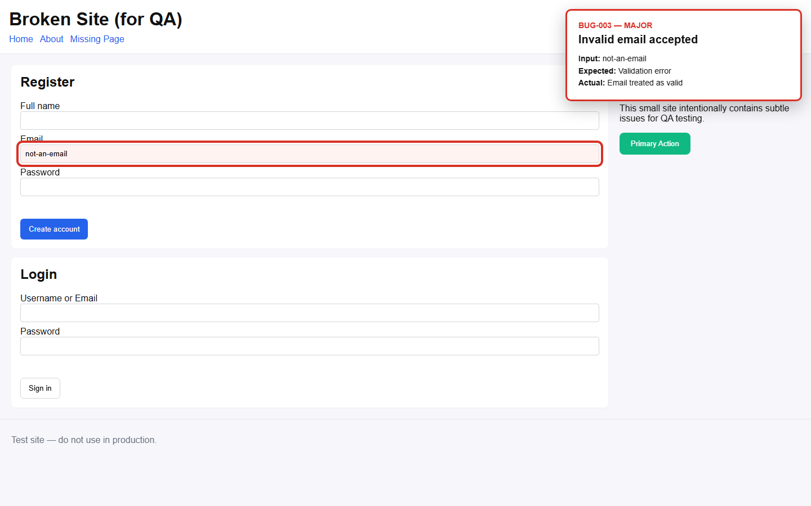

# 🧪 AI-Freelancer QA Automation

**Automated Black-Box Testing • Playwright • JavaScript • Screenshot Evidence • Automated Reporting**

A portfolio QA automation project that demonstrates a complete testing workflow for a deliberately broken web application.

The system automatically:

- runs black-box tests;
- detects product defects;
- classifies defect severity;
- captures screenshot evidence;
- creates a raw QA log;
- generates a Markdown QA report;
- generates a visual HTML QA dashboard.

---

## 🎯 Project Goal

The goal of this project is to demonstrate practical QA skills by combining:

**Manual QA reasoning + Test Automation + Evidence Collection + Automated Reporting**

Instead of simply checking whether an automated test technically passes or fails, the workflow records observable product defects and converts them into structured QA documentation.

---

# ⚡ One-Command QA Workflow

The complete workflow can be executed with one PowerShell command:

```powershell
.\run-qa.ps1
```

The automation then performs the complete pipeline:

```text
Website
   ↓
Playwright
   ↓
Black-box Testing
   ↓
Bug Detection
   ↓
Severity Classification
   ↓
Screenshot Evidence
   ↓
QA Log
   ↓
Report Generator
   ↓
Markdown Report
   +
HTML QA Dashboard
```

---

# 🛠 Technologies

| Technology | Purpose |
|---|---|
| JavaScript | Test and report-generation logic |
| Node.js | JavaScript runtime |
| Playwright | Browser automation and black-box testing |
| PowerShell | One-command workflow automation |
| HTML / CSS | Visual QA dashboard |
| Markdown | Structured QA documentation |
| VS Code | Development environment |

---

# 🔍 What Is Tested?

The automated black-box test currently checks:

- navigation;
- broken links;
- missing pages;
- registration form behaviour;
- malformed email validation;
- basic keyboard interaction;
- observable page behaviour from the user's perspective.

The test does not rely on the application's internal implementation to determine the expected result.

---

# 🐞 Current Automated Findings

The deliberately broken test website currently produces:

**3 Major defects**

| ID | Area | Severity | Finding |
|---|---|---|---|
| BUG-001 | Navigation | Major | About link points to a missing page |
| BUG-002 | Navigation | Major | Missing Page link points to a missing page |
| BUG-003 | Registration | Major | Malformed email is accepted |

## Current QA Result

🔴 **FAIL**

> **Important:** `FAIL` describes the QA status of the deliberately broken website.  
> The QA automation workflow itself completed successfully.

---

# 📸 Screenshot Evidence

When a supported defect is detected, Playwright automatically captures visual evidence.

The screenshots are stored in:

```text
evidence/
├── BUG-001.png
├── BUG-002.png
└── BUG-003.png
```

The navigation evidence highlights the problematic link and displays information about the failed target.

The registration evidence highlights the invalid email input and shows the Expected vs Actual behaviour.

### BUG-001


### BUG-002



### BUG-003



---

# 📊 HTML QA Dashboard

The workflow automatically generates a visual HTML report:

```text
QA_TEST_REPORT.html
```

The dashboard contains:

- overall QA status;
- total detected issues;
- severity summary;
- individual defect cards;
- Expected vs Actual behaviour;
- reproduction steps;
- screenshot evidence.

The same test data is also exported as a Markdown report:

```text
QA_TEST_REPORT.md
```

---

# 📋 Example Defect

## BUG-003 — Malformed Email Is Accepted

**Area:** Registration  
**Severity:** Major

### Expected

A malformed email address should be rejected.

### Actual

The value:

```text
not-an-email
```

is treated as valid.

### Reproduction Steps

1. Open the registration form.
2. Enter `not-an-email`.
3. Submit the form.
4. Observe that the malformed email is accepted.

### Evidence


---

# 🧠 QA Approach

This project uses a **black-box testing approach**.

The workflow focuses on externally observable behaviour:

```text
Expected Behaviour
        ↓
User Action
        ↓
Actual Behaviour
        ↓
Evidence
        ↓
Defect
        ↓
Severity
        ↓
QA Report
```

This allows automated testing to retain the structure of practical manual QA analysis.

---

# 🤖 Automated Defect Reporting

The custom JavaScript report generator reads the QA execution log and extracts structured defect information.

For each issue it processes:

- Bug ID;
- functional area;
- severity;
- expected result;
- actual result;
- reproduction steps;
- evidence path.

Duplicate defects are removed before report generation.

The generator then calculates the severity totals and determines the final QA status automatically.

---

# 🚦 QA Status Rules

| Condition | Result |
|---|---|
| Critical or Major defect detected | 🔴 FAIL |
| Only Minor / Trivial defects detected | 🟡 PASS WITH ISSUES |
| No defects detected | 🟢 PASS |

This status refers to the **tested application**, not whether the Playwright script itself executed successfully.

---

# 📁 Project Structure

```text
AI-Freelancer/
│
├── broken-site/
│   ├── index.html
│   ├── app.js
│   └── styles.css
│
├── evidence/
│   ├── BUG-001.png
│   ├── BUG-002.png
│   └── BUG-003.png
│
├── tests/
│   ├── broken-site.spec.js
│   ├── generate-report.js
│   └── smoke.spec.js
│
├── BUG_REPORT_TEMPLATE.md
├── CLIENT_DELIVERY_TEMPLATE.md
├── EXECUTION_PLAN.md
├── QA_CHECKLIST.md
├── QA_TEST_REPORT.md
├── QA_TEST_REPORT.html
├── README.md
├── run-qa.ps1
├── package.json
├── package-lock.json
└── .gitignore
```

---

# 🚀 How to Run

## 1. Install dependencies

```powershell
npm install
```

## 2. Install the Playwright browser

```powershell
npx playwright install chromium
```

## 3. Run the complete QA workflow

```powershell
.\run-qa.ps1
```

The workflow will:

1. run the Playwright test;
2. detect supported defects;
3. capture screenshot evidence;
4. save the QA execution log;
5. calculate severity totals;
6. determine PASS / FAIL status;
7. generate `QA_TEST_REPORT.md`;
8. generate `QA_TEST_REPORT.html`.

---

# ▶️ Run Playwright Directly

The black-box test can also be executed separately:

```powershell
npx playwright test tests/broken-site.spec.js --reporter=list
```

---

# 📄 Generate Reports Separately

If a QA log already exists, the report generator can be executed separately:

```powershell
node .\tests\generate-report.js
```

It generates:

```text
QA_TEST_REPORT.md
QA_TEST_REPORT.html
```

---

# 💡 Skills Demonstrated

This portfolio project demonstrates practical experience with:

### QA

- Black-box testing
- Manual QA reasoning
- Test case design
- Defect identification
- Bug reporting
- Severity classification
- Expected vs Actual analysis
- Reproduction steps
- Evidence collection
- Basic accessibility observation

### Automation

- Playwright
- Browser automation
- JavaScript
- Node.js
- PowerShell scripting
- Screenshot automation
- Automated log processing
- Automated report generation

### Workflow Design

- Test execution pipeline
- Structured QA output
- Defect deduplication
- Severity analysis
- Automated PASS / FAIL decision
- Markdown reporting
- HTML dashboard generation

---

# 🎯 What This Project Demonstrates

This project is not intended to represent a production-scale QA framework.

It is a **portfolio demonstration** of how a small QA workflow can combine human-style testing logic with automation.

Rather than stopping at:

```text
Test → Pass / Fail
```

the project demonstrates:

```text
Test
 ↓
Detect
 ↓
Analyse
 ↓
Classify
 ↓
Capture Evidence
 ↓
Document
 ↓
Report
```

This reflects the broader workflow involved in practical software quality assurance.

---

# 🔮 Planned Improvements

Possible future versions may include:

- 📱 mobile viewport testing;
- 🖥 cross-browser testing;
- ♿ automated accessibility checks;
- 🔌 API testing;
- ⚡ basic performance checks;
- 🔁 regression test suites;
- 📊 JSON test results;
- 📈 historical test trends;
- 🤖 GitHub Actions;
- 🚀 CI/CD integration.

---

# 👤 Portfolio Context

This project was created as a practical QA automation portfolio project while transitioning into the digital technology sector.

The project focuses on combining **manual QA reasoning, browser automation, structured bug reporting and automated evidence generation**.

It is designed to demonstrate practical entry-level skills relevant to roles such as:

- Junior QA Tester
- Manual QA Tester
- Junior Automation QA
- Software Tester
- Digital / Technical Support
- QA-focused Digital Operations

---

# 📌 Project Status

| Component | Status |
|---|---|
| Black-box QA | ✅ Working |
| Playwright automation | ✅ Working |
| Automatic bug detection | ✅ Working |
| Severity classification | ✅ Working |
| Screenshot evidence | ✅ Working |
| QA log generation | ✅ Working |
| Markdown report | ✅ Working |
| HTML QA dashboard | ✅ Working |
| One-command workflow | ✅ Working |
| GitHub Actions / CI | 🔜 Planned |

### Version

**v1.3 — Portfolio Edition**

### Current Test Target

**Deliberately broken demonstration website**

### Current Automated Findings

**3 Major defects**

### Tested Website

🔴 **FAIL**

### QA Automation Workflow

🟢 **WORKING**

---

## ⭐ Project Summary

**AI-Freelancer QA Automation** demonstrates a complete small-scale QA workflow:

> **Automated Testing → Defect Detection → Severity Classification → Screenshot Evidence → QA Documentation → Visual Report**

---

*QA Automation Portfolio Project*